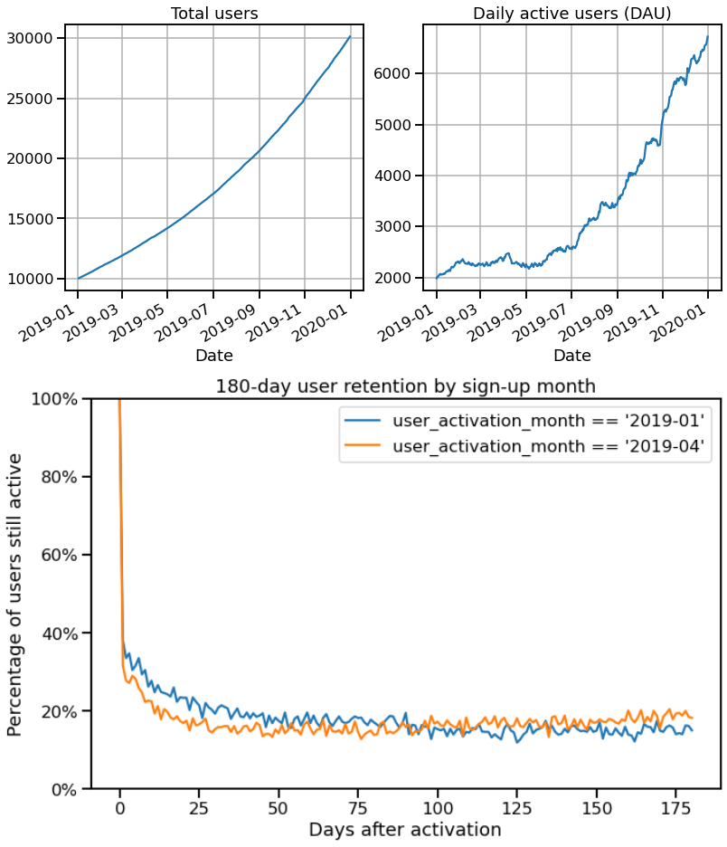

# saas-business-simulation
This project is a **simulator for SaaS product metrics** (e.g. user growth and funnel analytics).  Generate user-level and session-level datasets, given high-level growth parameters for the SaaS product and examine core concepts in SaaS growth metrics, e.g.:
- Retention curves
- DAU

The aim for this project is to simulate high-level SaaS metrics and demonstrate key SaaS concepts via synthetic data generated via Python.  It has _no practical use_ for causal inference or predictive modelling, from how the high-level parameters drive the data generation.

This project is a work in progress:
- `src`: functions for generating synthetic data are stored here (available for import).
- `notebooks`: demo analytics on the SaaS simulations.
- `tests`: unit tests for functionality.

## Data generation
The user metrics are generated first, given these high-level parameters:
- Date range
- `approx_yoy_growth_rate`: e.g. +200% year-on-year user growth.
- `start_users`: e.g. 10k users at the start of date range.

By the end date, the total users would then be approx. 30k (10k + 200% growth).

User engagement (as measured by user activity) is simulated over time via a random walk with drift, e.g. % of daily active users (% DAU) might move from 25% one quarter to 20% in the next quarter (with some movement in between).

From choice of different parameters or different seeds, simulations might lead to a business with explosive growth, stagnant growth or even decline in engagement (or even a mixture of these cases over time!).

The low-level metadata are filled based on the constraints provided by the high-level metrics.  Hence this is not a natural process (it's not the user / session characteristics that are driving the high-level metrics).
